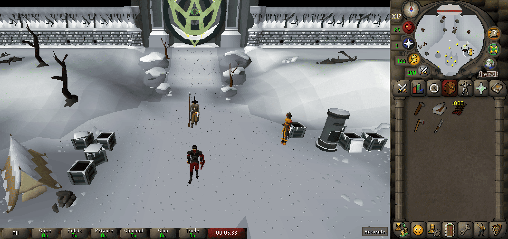

# Fixed Resizable Hybrid

**Fixed Resizable Hybrid** is a RuneLite plugin that reskins the "Resizable - Classic Layout" by styling it to match the aesthetics of Fixed Mode. It provides a faithful representation of the fixed mode interface, while preserving the benefits of resizable mode, such as a larger game viewport and minimizable chat.

---
## Using The Plugin
- Install and enable the plugin through the RuneLite community hub.
- Ensure your game client layout is **Resizable - Classic Layout**
  - Go to the ingame **Settings** > **Display Settings Tab** > **Game Client Layout**

### Recommended Settings
  - Enable the **Stretched Mode** plugin with 100% scaling option.
    - This prevents any gaps from separating the inventory from the minimap
  - Use the **GPU plugin** with UI scaling setting set to "xBR"
    - This might not be everbody's cup of tea, but it helps mask any scaling artifacts when not in integer scaling mode.
  - If you don't want to use the stretched mode plugin, you need to make sure the height of your client is set to 503 pixels (minimum height).
    - This is to prevent any gaps from being created.
    - You can set the height manually in the RuneLite settings.
### Features
- **Fixed Mode Aesthetic**:
    - Aligns the UI elements (e.g., minimap, inventory, orbs) to mimic the layout of Fixed Mode.
    - Replaces backgrounds and sprites to match the classic Fixed Mode design.

- **Automatic 16:9 Aspect Ratio Resizing**:
    - Optionally resizes the client to a 16:9 resolution for widescreen monitors.
    - Automatically calculates dimensions based on the client height.
---
## Future Plans
- Adding more customizable config settings.
  - For example, adding config options for user-specified aspect ratio resizing.
- Adding some sort of gap filling widget between the minimap and inventory to prevent render persistence when the user's client dimensions and/or stretched mode settings don't ensure that the gap is filled automatically.
---
## Known Compatability Issues
It's highly unlikely that any plugins which reskin the game's interface will work. (E.g. Interface Styles or Resource Packs Plugin).
- The resizable-classic interface widgets are resized when this plugin is active, so any plugins that have interfaces designed for the layout won't line up properly.
---
## Contact
Feel free to leave issues or feature requests to the [GitHub Project](https://github.com/Lapask/fixed-resizable-hybrid). Ill do my best to take a look at them.
You can also contact me via Discord (ID: Lapask).